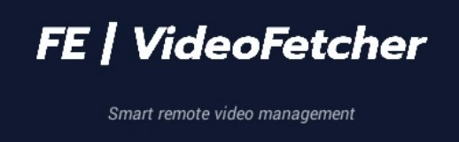
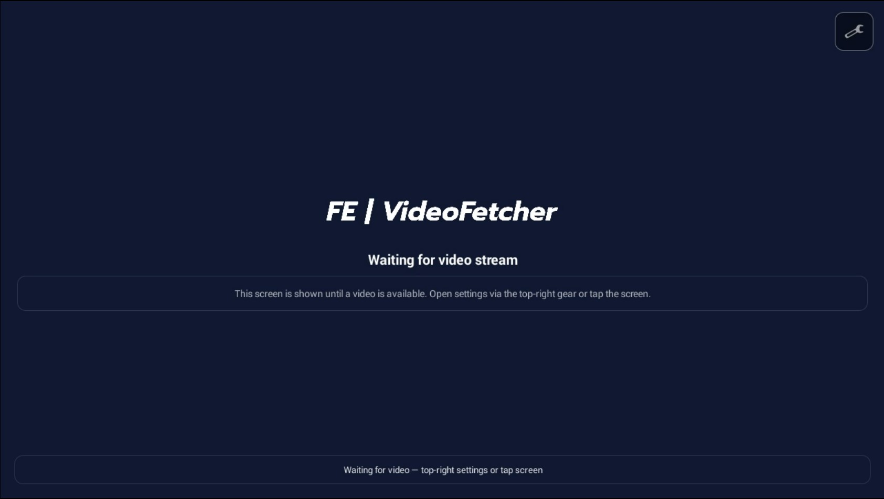
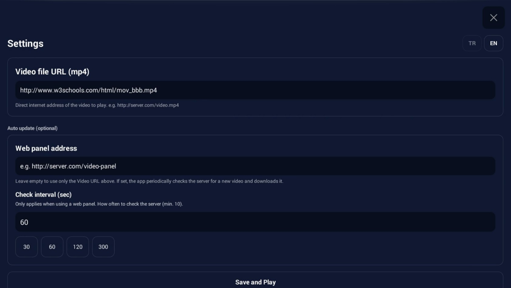
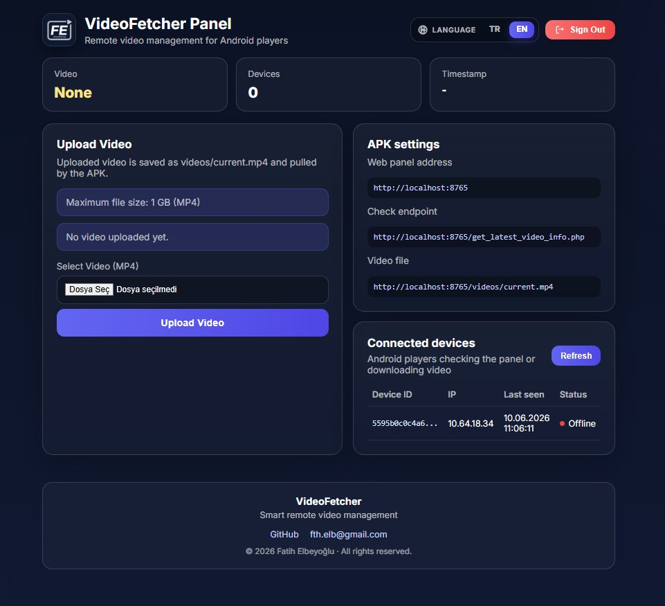
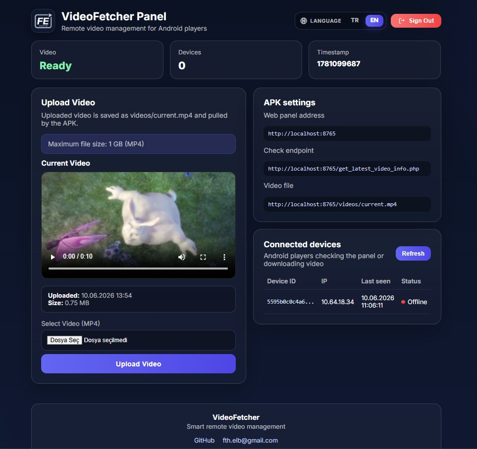

# Android VideoFetcher

<p align="center">
  
</p>

**VideoFetcher** — Android signage ve kiosk cihazları için uzaktan video yönetimi.

İmzalı Android uygulaması ve isteğe bağlı PHP web paneli içerir.

| Bileşen | Açıklama |
|---------|----------|
| `apk/` | İmzalı release APK |
| `web-panel/` | Video yükleme ve cihaz takip paneli |

**İletişim:** [fth.elb@gmail.com](mailto:fth.elb@gmail.com) · [GitHub](https://github.com/1mAdige/Android-VideoFetcher)

---

## Ekran görüntüleri

### Android uygulaması

Video beklerken bekleme ekranı ve ayarlar (doğrudan MP4 URL veya panel adresi):

<p align="center">
  
</p>
<p align="center"><em>Video akışı beklenirken — ayarlara sağ üstten veya ekrana dokunarak ulaşılır</em></p>

<p align="center">
  
</p>
<p align="center"><em>Ayarlar — MP4 URL, panel adresi ve kontrol aralığı (TR / EN)</em></p>

### Web paneli

Video yükleme, APK uç noktaları ve bağlı cihaz takibi:

<p align="center">
  
</p>
<p align="center"><em>Panel — henüz video yüklenmemiş durum</em></p>

<p align="center">
  
</p>
<p align="center"><em>Panel — video yüklendi, oynatıcı önizlemesi ve cihaz listesi</em></p>

---

## Özellikler

- Android 4.4+ (API 19) desteği, yatay tam ekran oynatma
- Web paneli üzerinden MP4 yükleme ve cihazlara otomatik dağıtım
- Panelsiz kullanım: doğrudan MP4 URL’si ile video indirme
- Veritabanı gerektirmez — dosya tabanlı yapı (`videos/`, `data/devices.json`)
- Türkçe / İngilizce arayüz (APK ve panel)

---

## Kullanım modları

### Panelsiz — doğrudan MP4 linki

Ayarlarda **Video URL** alanına geçerli bir MP4 adresi girin; panel adresini boş bırakın.

```
Örnek: https://sunucu.com/videolar/tanitim.mp4
```

Uygulama dosyayı indirir ve oynatır. Bazı sunucu veya CDN yapılandırmalarında bağlantı testi gerekebilir.

### Panel ile — uzaktan güncelleme

Web panelinden video yüklersiniz; uygulama belirli aralıklarla sunucuyu kontrol eder ve güncel videoyu indirir.

```
Panel  →  video yükle  →  videos/current.mp4
              ↑
Uygulama  →  kontrol  →  indir  →  oynat
```

---

## Kurulum

### 1. APK

`apk/VideoFetcher-1.0.1-release.apk` dosyasını Android cihaza yükleyin.

### 2. Web paneli (isteğe bağlı)

Canlı kullanım için panel dosyalarını **PHP destekleyen bir hosting**e yükleyin (bkz. [Hosting](#hosting)).

Yerel deneme (Windows):

```bat
cd web-panel
start_server.bat
```

> `start_server.bat` ve `firewall_allow_8765.bat` yalnızca **yerel deneme** içindir. Üretim ortamında PHP hosting kullanın.

### 3. Uygulama ayarları

**Panel modu**

| Alan | Değer |
|------|--------|
| Video URL | Boş |
| Web panel adresi | `https://alanadiniz.com/panel/` |
| Kontrol süresi | 30–60 sn |

**Panelsiz mod**

| Alan | Değer |
|------|--------|
| Video URL | `https://.../video.mp4` |
| Web panel adresi | Boş |

---

## Hosting

| Gerekli | Gerekmez |
|---------|----------|
| PHP 7.0+ | Veritabanı (MySQL, PostgreSQL vb.) |
| `videos/` yazma izni | Redis, queue, Docker |
| `data/` yazma izni | Ek sunucu bileşeni |

`web-panel/` içeriğini FTP veya SFTP ile sunucuya kopyalayın. Kurulumdan sonra `config.local.php` ile giriş bilgilerini mutlaka değiştirin (aşağıya bakın).

---

## Güvenlik

**İlk kurulumda panel şifresini değiştirin.** Yerel deneme için varsayılan: `admin` / `changeme` — canlı sunucuda kullanmayın.

```bat
copy web-panel\config.local.example.php web-panel\config.local.php
```

`config.local.php` dosyasını düzenleyip güçlü bir şifre tanımlayın. Bu dosya sürüm kontrolüne eklenmez.

- Üretim ortamında **HTTPS** kullanın
- Varsayılan şifreyle canlı sunucu açmayın
- Ayrıntılar: [SECURITY.md](SECURITY.md)

---

## Gereksinimler

| | |
|--|--|
| Android | 4.4+, landscape |
| Panel | PHP 7.0+, yazılabilir `videos/` ve `data/` |

---

## Lisans

MIT — [LICENSE](LICENSE)
